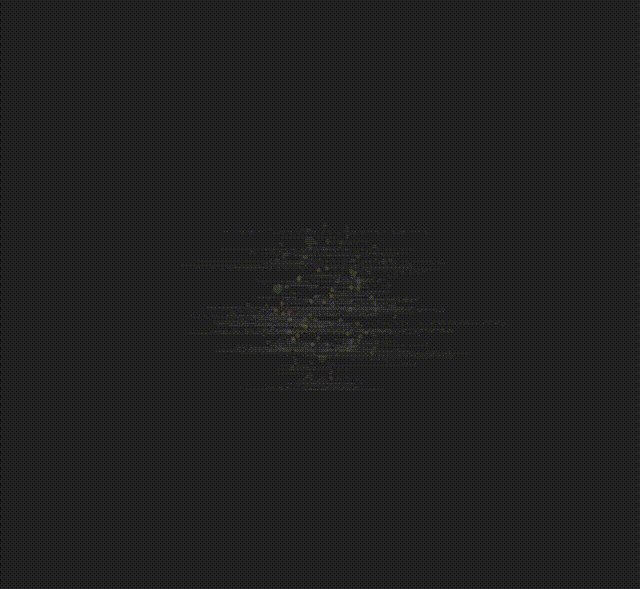

I'm a bit obsessive about note taking. The act of writing things down helps my process, focus, and recall, however I've long felt like I've been leaving a key benefit on the table -- discovery of past knowledge. When I'm working on something, my in-the-moment recall for notes often yields a lengthy search effort, and is predicated by my recall that a note exists in the first place.

At present, I have ~15 years of notes scattered across multiple systems, accumulated through university, my professional software development career, music projects, home maintenance, and everything else I've documented. That's roughly 3200 markdown files representing countless hours of learning, problem-solving, and decision-making. The knowledge is there, but finding it when I need it? That's been the challenge.

The core issue isn't just organization—it's consistency. I've moved between different note-taking applications over the years and experimented with various organizational methods. Some were paid, like [Evernote](https://evernote.com/), some were simply markdown files on disk that I built [some tooling around](https://github.com/mpataki/note) (S3 sync, git, etc), and these days I'm using the [PARA](https://fortelabs.com/blog/para/) method on top of the ever popular [https://obsidian.md/](Obsidian). Each migration left me with a folder of "everything before today" that I'd promise myself to reorganize later. Spoiler: later never came. My approach to tagging was no better. Sometimes I'd tag `performance-optimization`, other times `perf-tuning`, and still other times `optimization`. The same concept, three different tags, zero discoverability.

With the advent of LLMs, particularly Claude, I decided to tackle this head-on. The result is a system that maintains semantic consistency across my entire note corpus using AI-assisted tagging, vector embeddings, and Redis Stack. More importantly, it actually works—I'm regularly rediscovering university notes I'd completely forgotten about, and making connections across more than a decade of accumulated knowledge.

## The Vision: Discovery-Focused Tagging

Before diving into the technical solution, it's worth understanding what "good tagging" means in this context. I'm not trying to create a perfect taxonomy or file everything into neat hierarchical categories. Instead, I want tags that enable discovery—ways to find notes when I'm approaching a problem from a different angle than when I originally wrote them.

The key insight is that tags should span multiple conceptual levels. A note about optimizing Redis performance should have broad tags (like `system-architecture`), specific tags (like `redis` or `aof`), and cross-cutting tags (like `performance-optimization`). This creates multiple "discovery paths" into the same content. Someone searching for Redis work finds it. Someone researching performance patterns finds it. Someone exploring system architecture finds it. Three different contexts, same note, maximum utility.

The challenge is maintaining this consistency across thousands of notes. That's where vector embeddings comes in.

## The Technical Solution

At its core, this system does something conceptually simple: when suggesting tags for a note, check if we've used similar tags before. If we have, use the existing tag instead of creating a new one. The magic is in how we define "similar."

### Architecture Overview

The system consists of a few Python scripts orchestrated through a `/tag` command I use in Claude Code:

1. **Tag Suggestion**: Claude reads the note content and my tagging guidelines, then suggests 3-5 tags spanning different conceptual levels
2. **Similarity Check**: Each suggested tag is converted to a vector embedding using the `all-MiniLM-L6-v2` sentence transformer model from [https://huggingface.co/](Hugging Face).
3. **Vector Search**: [https://redis.io/about/about-stack/](Redis Stack)'s HNSW index finds existing tags with high cosine similarity (threshold: 0.7+)
4. **Tag Resolution**: If a similar tag exists, use it. If not, create the new tag.
5. **Application**: Write tags to the note's YAML frontmatter and record new embeddings and usage counters in Redis.

The entire flow is surprisingly fast—tagging a note takes just a couple seconds, with most of that time spent in the Claude API call.

### Usage in Practice

In my daily workflow, tagging a note looks like this:

```bash
/tag inbox/meeting-notes.md
```

Claude reads the note, considers my tagging guidelines, suggests appropriate tags, and the system ensures those tags align with my existing vocabulary. If I've written about `distributed-systems` before, it won't create `distributed-computing` as a duplicate. The note gets tagged, Redis gets updated, and I move on.

For the initial backfill of 15 years of notes, I used parallel processing:

```bash
find areas/truck -type f -name "*.md" | xargs -P 8 -I {} python3 tag.py "{}"
```

This let me tag hundreds of notes at a time, working through directories systematically. I used Claude Haiku for this bulk processing to keep costs reasonable, while my interactive work uses Claude Sonnet for better quality.

### The Results

After tagging much of my entire corpus, here's what the distribution looks like:

```
Total unique tags: 2028
Total tagged notes: 2650

Top 10 most used tags:
  computer-science: 533 notes
  assignment: 233 notes
  math: 207 notes
  problem-solving: 186 notes
  software-engineering: 171 notes
  academics: 170 notes
  academic-course: 159 notes
  course-materials: 158 notes
  system-architecture: 157 notes
  github: 140 notes
```

Just because it's cool, here's what that looks like visualized in Obsidian's graph view:



The white dots are individual notes, and green are the tags connecting them, sized according to their usage count. You can see my my historical areas of focus in those numbers. `computer-science` dominates because of my CS degree from Waterloo. `assignment` and `academic-course` capture my university years. `software-engineering`, `system-architecture`, and `github` represent my professional career. And `problem-solving` (although possibly too broad) cuts across everything—186 notes spanning university math, professional development, and personal projects.

The 2,028 unique tags across 2,650 notes feels about right. Not so few that everything is overly broad, not so many that I'm creating single-use tags. The semantic similarity check naturally prevents tag explosion while still allowing genuinely distinct concepts to have their own tags.

### Technical Details for the Curious

The Redis setup uses a vector index with HNSW (Hierarchical Navigable Small World) algorithm for fast approximate nearest neighbor search. Each tag gets stored with two keys:

- `tag_embeddings:<tag>` - The 384-dimensional float32 vector plus metadata
- `tag_usage:<tag>` - Usage count and array of note IDs using this tag

This structure lets me query similarity efficiently and track which notes use which tags. The similarity threshold of 0.7 was determined empirically—I looked at several examples of tags I knew should be kept separate versus merged, and adjusted until the behavior felt right.

One important detail: I track a `tagging-agent-version` in each note's frontmatter. As I iterate on the tagging logic or guidelines, I can bump this version number. This prevents retagging notes unnecessarily, but also lets me selectively re-process notes when I make meaningful improvements to the system.

## What I Learned

### Principle-Based Prompting Beats Examples

Standard prompt engineering advice says to provide examples. "Show the LLM what good output looks like." For most use cases, this works great. For this one? It backfired spectacularly.

When I initially included specific example tags in my prompting—things like "use tags like `performance-optimization`, `database-tuning`, `system-design`"—the LLM would disproportionately reuse exactly those tags. I'd end up with `performance-optimization` everywhere, even when more specific or different tags would be better. The examples biased the model toward pattern-matching rather than genuine reasoning.

My solution was to write guidelines that describe *how to think about tags* rather than *what tags to use*. The [tagging guidelines](https://github.com/mpataki/note-tags/blob/main/tagging-guidelines.md) in my repo focus on discovery questions ("What is this fundamentally about?", "What tools are involved?", "What broader pattern does this exemplify?") and the breadth-depth spectrum concept. This framework gives Claude enough structure to make consistent decisions without anchoring on specific vocabulary.

The improvement was dramatic. Tags became more thoughtful, more varied, and paradoxically more consistent because they were chosen based on semantic meaning rather than surface-level pattern matching.

### Iteration Is Essential

The first version of this system was messier. I was doing linear scans through all embeddings in Python rather than using Redis's vector search features. Parallelization wasn't carefully considered. The tagging guidelines were less refined.

Writing this blog post actually forced me to look critically at what I'd built. I realized the linear scan was embarrassingly inefficient and migrated to Redis Stack's proper vector search. I thought through potential race conditions in parallel tagging. I refined the guidelines based on what actually worked versus what I thought would work.

The `tagging-agent-version` system turned out to be crucial for this iterative improvement. I can experiment with changes, see how they perform on a subset of notes, then decide whether to roll out a full re-tagging pass. Version 1.2 (current) produces noticeably better tags than 1.0, but I didn't have to throw away the old work—I can see which notes need upgrading and process them selectively.

### Rediscovery Is the Real Win

The technical achievement is satisfying, but the practical value is in rediscovery. I regularly find notes I'd completely forgotten about. University mathematics notes that are relevant to a current graph theory problem. Old architecture decisions that inform new system design. Media encoding concepts that apply to audio software I'm building at work.

The breadth-depth spectrum in my tagging strategy makes this possible. When I search for `redis`, I find Redis-specific notes. When I search for `performance-optimization`, I find the Redis notes *plus* notes about optimizing React apps, database queries, audio processing pipelines, and a dozen other domains. The cross-cutting tags create unexpected connections.

This is exactly what I wanted from 15 years of note-taking: augmented memory that surfaces relevant knowledge when I need it, not just when I remember to look for it.

## Try It Yourself

The entire system is open source and available at [github.com/mpataki/note-tags](https://github.com/mpataki/note-tags). It's designed for Obsidian but could be adapted to any markdown-based note system. You'll need:

- Python 3.8+
- Redis Stack (for the vector search module)
- An Anthropic API key

The README includes detailed setup instructions for macOS, Linux, and Docker. The scripts are modular enough that you can adapt them to your own tagging philosophy and organizational system.

If you've accumulated years of notes across different systems and struggle with consistency, this approach might resonate. The combination of LLM reasoning, semantic similarity, and versioned iteration creates something that actually scales with your knowledge base rather than fighting against it.

---

*The code and complete implementation details are available at [github.com/mpataki/note-tags](https://github.com/mpataki/note-tags). Issues and pull requests welcome.*
